# ForceEqual AI - Complete Project Walkthrough
**Presentation Script & Architecture Documentation**

---

## Table of Contents
1. [Project Overview](#project-overview)
2. [Agent Architecture](#agent-architecture)
3. [Agent Flow & Pipeline](#agent-flow--pipeline)
4. [Editing System](#editing-system)
5. [Export System](#export-system)
6. [Key Decisions & Tradeoffs](#key-decisions--tradeoffs)

---

## Project Overview

### **Problem Statement**
Businesses struggle to develop comprehensive strategic plans. They lack a structured approach to problem decomposition, stakeholder analysis, and actionable execution plans. **ForceEqual AI** automates this entire process using a multi-agent AI system.

### **Solution**
A Next.js web application that:
- Takes a problem statement as input
- Runs 3 specialized AI agents sequentially
- Generates a professional, interactive report
- Allows real-time editing and exports to DOCX/PDF

### **Tech Stack**
```
Frontend:  Next.js 16 + React 19 + TypeScript
Backend:   Node.js Serverless (Vercel)
AI Model:  Google Gemini 3-Pro-Preview
State:     Zustand (React store)
UI:        Radix UI + shadcn/ui + Tailwind CSS
Export:    docx library + html2canvas + jsPDF
```

**Dependencies:**
- `@google/generative-ai` - Gemini API integration
- `mermaid` - Diagram rendering (flowcharts, pie charts, Gantt charts)
- `react-markdown` - Markdown parsing
- `marked` - Markdown tokenization
- `docx` - Word document generation
- `html2canvas` + `jspdf` - PDF export

---

## Agent Architecture

### **Overview: The 3-Agent Pipeline**

```
┌─────────────────────────────────────────────────────────────────┐
│                    THREE-AGENT PIPELINE SYSTEM                  │
│                    (Sequential Processing)                       │
└─────────────────────────────────────────────────────────────────┘

            Problem Statement (User Input)
                        ↓
            ┌───────────────────────┐
            │   PLANNER AGENT       │
            │   (Breakdown & Plan)  │
            └───────────────────────┘
                        ↓
                  [PlannerOutput]
                        ↓
            ┌───────────────────────┐
            │   INSIGHT AGENT       │
            │  (Enrich & Analyze)   │
            └───────────────────────┘
                        ↓
                  [InsightOutput]
                        ↓
            ┌───────────────────────┐
            │   EXECUTOR AGENT      │
            │  (Polish & Format)    │
            └───────────────────────┘
                        ↓
                  [ExecutorOutput]
                        ↓
                   Final Report
                  (4 Sections)
```

---

### **1️⃣ PLANNER AGENT** 
**Role:** Strategic Problem Decomposition
**File:** `src/lib/agents/planner.ts`

#### **Script:**
> "The Planner Agent is the first in our pipeline. Think of it as a strategic consultant receiving your business challenge. Its job is to *break down* the problem into digestible pieces. It answers four critical questions:

> 1. **What's the actual problem?** → Problem Breakdown
> 2. **Who are all the players involved?** → Stakeholders
> 3. **What's our high-level approach?** → Solution Approach  
> 4. **How do we execute this?** → Action Plan"

#### **Technical Details:**

| Aspect | Details |
|--------|---------|
| **Model** | `gemini-3-pro-preview` |
| **Temperature** | 0.7 (Creative, yet structured) |
| **Input** | Problem statement (text) |
| **Output** | `PlannerOutput` (4 sections) |
| **Processing Time** | ~8 seconds |

#### **Output Structure (PlannerOutput)**

```typescript
interface PlannerOutput {
  problemBreakdown: string;      // Problem analysis, scope, challenges
  stakeholders: string;           // Markdown table + Mermaid pie chart
  solutionApproach: string;       // High-level outline + Mermaid diagram
  actionPlan: string;             // Phases, milestones + Gantt chart
}
```

#### **Mermaid Diagram: Planner Agent Process**

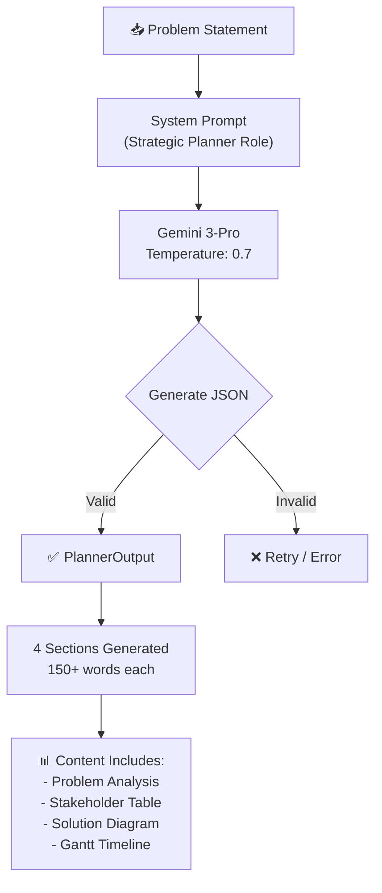

#### **Content Requirements**
Each section must be:
- **Substantive:** 150+ words minimum
- **Markdown-formatted:** Headings, bullets, tables
- **Diagram-enriched:** Mermaid diagrams where applicable
- **Professional tone:** Business-appropriate language

---

### **2️⃣ INSIGHT AGENT**
**Role:** Strategic Enrichment & Deep Analysis
**File:** `src/lib/agents/insight.ts`

#### **Script:**
> "The Insight Agent is our second expert. It takes what the Planner created and *enriches* it with market context, competitive data, and risk analysis. It asks:

> 1. **What market trends affect this?** (Context)
> 2. **What could go wrong?** (Risk Analysis)
> 3. **How feasible is this technically?** (Technical Assessment)
> 4. **What resources do we need?** (Budget & Resource Planning)
> 5. **How do we measure success?** (KPIs)"

#### **Technical Details**

| Aspect | Details |
|--------|---------|
| **Model** | `gemini-3-pro-preview` (same) |
| **Temperature** | 0.7 (Creative depth) |
| **Input** | `PlannerOutput` from Planner |
| **Output** | `InsightOutput` (enhanced 4 sections) |
| **Processing Time** | ~10 seconds |

#### **Enhancements Added**

The Insight Agent transforms each section:

- **Problem Breakdown** → Adds market context + industry trends
- **Stakeholders** → Adds Power/Interest Grid + sentiment analysis
- **Solution Approach** → Adds competitive analysis + feasibility matrix
- **Action Plan** → Adds resource requirements + budget considerations

#### **Mermaid Diagram: Insight Agent Enhancement**

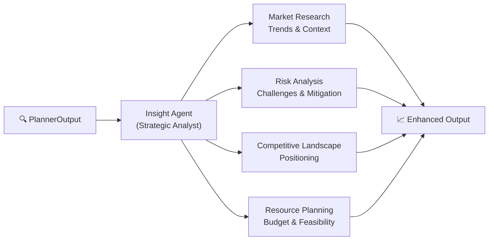

---

### **3️⃣ EXECUTOR AGENT**
**Role:** Report Professionalization & Formatting
**File:** `src/lib/agents/executor.ts`

#### **Script:**
> "The Executor Agent is our final polish expert. It takes the enriched content and transforms it into a *premium consulting-grade report*. This agent:

> 1. Ensures minimum 250 words per section
> 2. Applies professional formatting (callout boxes, matrices)
> 3. Optimizes all Mermaid diagrams
> 4. Adds visual hierarchy and styling
> 5. Makes the report presentation-ready"

#### **Technical Details**

| Aspect | Details |
|--------|---------|
| **Model** | `gemini-3-pro-preview` |
| **Temperature** | 0.7 |
| **Input** | `InsightOutput` from Insight |
| **Output** | `ExecutorOutput` (polished 4 sections) |
| **Processing Time** | ~2 seconds |

#### **Transformation Rules**

```
MINIMUM SECTION REQUIREMENTS:
├─ Length: 250+ words per section
├─ Format: Professional consulting style
├─ Visuals: Optimized Mermaid diagrams
├─ Callouts: Key insights highlighted
├─ Tables: Formatted with markdown tables
└─ Tone: Executive-appropriate language
```

#### **Mermaid Diagram: Executor Agent Refinement**

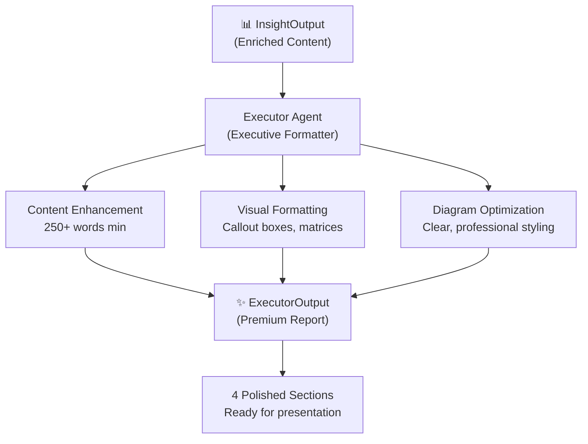

---

## Agent Flow & Pipeline

### **Complete Sequential Pipeline**

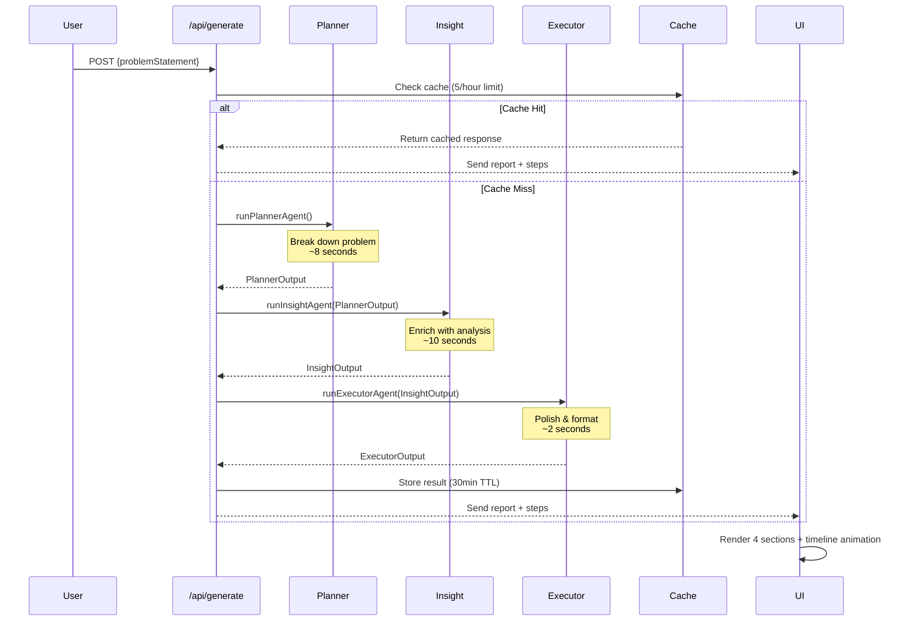

### **Step-by-Step Flow Diagram**

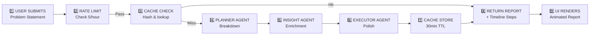

### **API Route: POST /api/generate**

**File:** `src/app/api/generate/route.ts`

#### **Endpoint Specifications**

```typescript
// Request
POST /api/generate
Content-Type: application/json
{
  "problemStatement": "How can we improve customer retention?"
}

// Response (200 OK)
{
  "report": {
    "id": "uuid-string",
    "problemStatement": "...",
    "sections": [
      {
        "id": "problem",
        "title": "Problem Breakdown",
        "content": "markdown...",
        "icon": "AlertCircle",
        "agentSource": "executor"
      },
      // ... 3 more sections (stakeholders, solution, action)
    ],
    "versions": [],
    "createdAt": "2024-03-22T10:30:00Z",
    "updatedAt": "2024-03-22T10:30:00Z"
  },
  "agentSteps": [
    {
      "agentName": "Planner Agent",
      "status": "completed",
      "description": "Breaking down the problem...",
      "duration": 8200,
      "output": "{...}"
    },
    // ... more steps
  ]
}
```

#### **Rate Limiting Strategy**

```javascript
// Implementation in /api/generate
rateLimitCache = Map<IP, {count, resetTime}>
RATE_LIMIT_WINDOW = 1 hour
MAX_REQUESTS = 5 per hour per IP

if (requestCount >= 5 && withinWindow) {
  return 429 Too Many Requests
}
```

#### **Caching Strategy**

```javascript
// Cache implementation
cacheKey = hash(problemStatement)
cacheTTL = 30 minutes
maxCacheItems = 50 LRU

getCached(key)  → Returns cached response if exists
setCache(key, value, ttl)  → Stores response
```

#### **Error Handling**

| Error | Status | Handling |
|-------|--------|----------|
| Missing API Key | 500 | Immediate error (prevents 504) |
| Empty problem statement | 400 | Validation error |
| Rate limit exceeded | 429 | Retry-After header |
| Agent JSON parsing failed | 500 | Fallback error message |
| Timeout (60s) | 503 | Vercel Node.js limit |

---

### **Timeline Animation (AgentSteps)**

The `AgentStep` array drives the UI animation that shows progress in real-time.

```typescript
interface AgentStep {
  agentName: string;  // "Planner Agent", "Insight Agent", "Executor Agent"
  status: 'pending' | 'running' | 'completed' | 'error';
  description: string;  // User-friendly status message
  duration?: number;  // Milliseconds taken
  output?: string;  // JSON of agent result (for debugging)
}
```

#### **Status Progression Example**

```
[Initial]
Planner Agent: pending → "Breaking down the problem..."
Insight Agent: pending → "Waiting for planner..."
Executor Agent: pending → "Waiting for insight..."

[During Execution]
Planner Agent: running → "Analyzing scope and challenges..."
Insight Agent: pending → "Waiting for planner..."
Executor Agent: pending → "Waiting for insight..."

[Completion]
Planner Agent: completed, duration: 8200ms
Insight Agent: running → "Adding market context and risks..."
Executor Agent: pending → "Waiting for insight..."

[Final]
Planner Agent: completed, duration: 8200ms
Insight Agent: completed, duration: 10100ms
Executor Agent: completed, duration: 2050ms
```

---

## Editing System

### **How Real-Time Editing Works**

#### **Script:**
> "Users often want to refine individual sections. Instead of regenerating the entire report, we have **targeted editing** capabilities. When you select text in a section and click 'Edit', an AI copyeditor takes over to refine just that part while maintaining professional quality."

### **UI Flow: Text Selection → Editing**

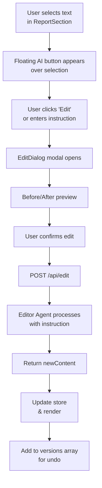

### **API Route: POST /api/edit**

**File:** `src/app/api/edit/route.ts`

#### **Request/Response**

```typescript
// Request
POST /api/edit
{
  "sectionId": "solution",
  "currentContent": "our approach is...",
  "instruction": "make this more customer-focused",
  "highlightedText": "our approach is..."  // optional
}

// Response
{
  "newContent": "our customer-centric approach..."
}
```

#### **Editor Agent Configuration**

```typescript
// System Prompt for Editor Agent
const EDITOR_SYSTEM_PROMPT = `
You are a professional copyeditor specializing in strategic business documents.

Your job: Take the provided section content and apply the user's edit instruction.

Rules:
1. Maintain markdown formatting (headings, lists, Mermaid blocks)
2. Preserve professional tone
3. Keep Mermaid diagrams intact
4. If text is highlighted, edit only that portion
5. Return ONLY the markdown content, no JSON wrapper
`;

// Model Configuration
model: "gemini-3-pro-preview"
temperature: 0.6  // Lower = more professional, consistent
```

### **Version History (Undo System)**

Every edit is tracked in the `versions` array:

```typescript
interface VersionEntry {
  id: string;              // UUID
  sectionId: string;       // 'problem', 'stakeholders', 'solution', 'action'
  previousContent: string; // Before edit
  newContent: string;      // After edit
  editPrompt: string;      // What the user asked for
  timestamp: string;       // ISO 8601
}
```

#### **Version Tracking Flow**

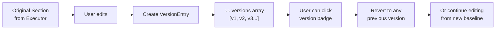

#### **Editing Components**

| Component | File | Purpose |
|-----------|------|---------|
| **ReportSection** | `src/components/ReportSection.tsx` | Displays section with floating edit button on text selection |
| **EditDialog** | `src/components/EditDialog.tsx` | Modal for entering edit instructions and confirming changes |
| **AgentTimeline** | `src/components/AgentTimeline.tsx` | Shows real-time generation progress (3 agents) |

### **ReportSection Component**

```typescript
// Simplified flow
<ReportSection section={section}>
  {/* Render markdown */}
  <ReactMarkdown plugins={[remarkGfm]}>
    {section.content}
  </ReactMarkdown>
  
  {/* Render Mermaid diagrams */}
  <MermaidDiagram code={diagramCode} />
  
  {/* On text selection */}
  onMouseUp={() => {
    if (selectedText) {
      showFloatingEditButton()
    }
  }}
  
  {/* Click to edit */}
  onClick={() => {
    setEditingSection(section.id)
    setHighlightedText(selection)
    openEditDialog()
  }}
  
  {/* Version badge */}
  {section.versions.length > 0 && (
    <Badge>{section.versions.length} edits</Badge>
  )}
</ReportSection>
```

### **Mermaid Diagram: Edit Workflow**

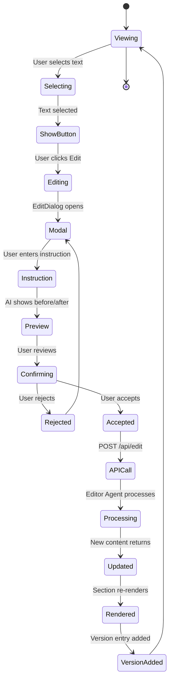

---

## Export System

### **Overview: Dual Export (DOCX + PDF)**

#### **Script:**
> "Once you have your perfect report, you can export it as a professional Word document or PDF. Both preserve all the formatting, tables, and diagrams you've created. Under the hood, they work very differently."

### **Export Architecture**

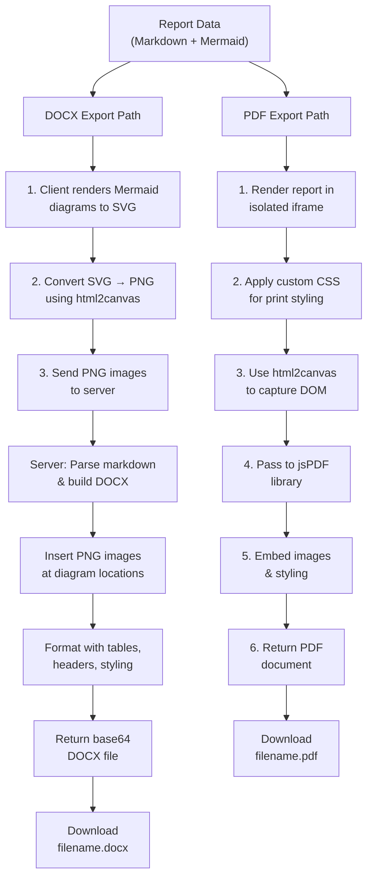

---

### **1️⃣ DOCX Export System**

**Files:** 
- Frontend: `src/components/ExportButtons.tsx`
- Backend: `src/app/api/export/docx/route.ts`

#### **Step-by-Step Process**

**Phase 1: Client-Side (SVG → PNG Conversion)**

```typescript
// ExportButtons.tsx
async function exportAsDocx() {
  // 1. Get all Mermaid SVGs from DOM
  const mermaidElements = document.querySelectorAll('[data-mermaid]');
  const diagramImages: MermaidImage[] = [];
  
  // 2. For each SVG, convert to PNG
  for (const element of mermaidElements) {
    const svg = element.querySelector('svg');
    const canvas = await html2canvas(svg, {
      scale: 2,  // Retina display support (2x)
      backgroundColor: '#ffffff'
    });
    const png = canvas.toDataURL('image/png');
    diagramImages.push({
      id: element.id,
      png: png,
      width: svg.width.baseVal.value,
      height: svg.height.baseVal.value
    });
  }
  
  // 3. Send to server
  const response = await fetch('/api/export/docx', {
    method: 'POST',
    body: JSON.stringify({
      report: reportData,
      diagramImages: diagramImages
    })
  });
  
  // 4. Download DOCX file
  const docxBase64 = await response.json();
  const binary = atob(docxBase64);
  const blob = new Blob([binary], { type: 'application/octet-stream' });
  saveAs(blob, `report-${report.id}.docx`);
}
```

**Phase 2: Server-Side (DOCX Generation)**

```typescript
// /api/export/docx/route.ts
export async function POST(req: Request) {
  const { report, diagramImages } = await req.json();
  
  // 1. Parse markdown sections
  const sections = report.sections;  // 4 ReportSection objects
  
  // 2. Create DOCX document
  const docx = new Document({
    sections: sections.map(section => ({
      children: [
        // Section title
        new Heading({
          text: section.title,
          level: 1,
          bold: true,
          size: 28
        }),
        
        // Parse markdown content
        ...parseMarkdownToDOCX(section.content, diagramImages),
        
        // Page break between sections
        new PageBreak()
      ]
    }))
  });
  
  // 3. Generate DOCX bytes
  const buffer = await Packer.toBuffer(docx);
  
  // 4. Return as base64
  return NextResponse.json({
    docx: buffer.toString('base64')
  });
}

function parseMarkdownToDOCX(markdown: string, images: MermaidImage[]): Paragraph[] {
  // Parse markdown and convert to DOCX elements
  // - Headings → Heading elements (with styling)
  // - Lists → List elements
  // - Bold/Italic → Text runs with formatting
  // - Mermaid blocks → Image elements (from diagramImages)
  // - Tables → Table elements (from markdown tables)
  
  const lines = markdown.split('\n');
  const docxElements = [];
  
  for (const line of lines) {
    if (line.startsWith('###')) {
      docxElements.push(new Heading({
        text: line.replace(/^#+\s/, ''),
        level: 3
      }));
    } else if (line.startsWith('- ')) {
      docxElements.push(new Paragraph({
        text: line.substring(2),
        bullet: { level: 0 }
      }));
    } else if (line.startsWith('```mermaid')) {
      // Find corresponding image and insert
      const diagramId = extractDiagramId(line);
      const image = images.find(img => img.id === diagramId);
      if (image) {
        docxElements.push(new Paragraph({
          children: [
            new ImageRun({
              data: Buffer.from(image.png, 'base64'),
              transformation: { width: image.width, height: image.height }
            })
          ]
        }));
      }
    } else if (line.trim()) {
      docxElements.push(new Paragraph({ text: line }));
    }
  }
  
  return docxElements;
}
```

#### **DOCX Output Structure**

```
document.docx
├─ Section 1: Problem Breakdown
│  ├─ Heading (styled)
│  ├─ Paragraphs with formatting
│  ├─ Tables (from markdown)
│  ├─ Diagram images (png embedded)
│  └─ Page break
├─ Section 2: Stakeholders
│  ├─ Heading
│  ├─ Stakeholder table (markdown → DOCX table)
│  ├─ Pie chart image
│  └─ Page break
├─ Section 3: Solution Approach
│  ├─ Heading
│  ├─ Solution content
│  ├─ Architecture/Flow diagram
│  └─ Page break
└─ Section 4: Action Plan
   ├─ Heading
   ├─ Timeline table
   ├─ Gantt chart image
   └─ End of document
```

---

### **2️⃣ PDF Export System**

**Status:** Route structure prepared, implementation ready
**Path:** `src/app/api/export/pdf/` (to be implemented)

#### **Planned Implementation**

```typescript
// /api/export/pdf/route.ts
export async function POST(req: Request) {
  const { report } = await req.json();
  
  // 1. Create PDF instance
  const pdf = new jsPDF({
    orientation: 'portrait',
    unit: 'mm',
    format: 'a4'
  });
  
  // 2. Render each section
  let yPosition = 20;
  
  for (const section of report.sections) {
    // Section title
    pdf.setFontSize(18);
    pdf.text(section.title, 20, yPosition);
    yPosition += 10;
    
    // Section content
    pdf.setFontSize(11);
    const splitText = pdf.splitTextToSize(section.content, 170);
    pdf.text(splitText, 20, yPosition);
    yPosition += splitText.length * 5;
    
    // Handle Mermaid diagrams
    const diagramBlocks = extractMermaidBlocks(section.content);
    for (const diagram of diagramBlocks) {
      // Render diagram as image and embed
      const diagramImage = await renderMermaidToImage(diagram);
      pdf.addImage(diagramImage, 'PNG', 20, yPosition, 170, 100);
      yPosition += 110;
    }
    
    // Page break
    pdf.addPage();
    yPosition = 20;
  }
  
  // 3. Return PDF bytes
  const pdfBytes = pdf.output('arraybuffer');
  return new Response(pdfBytes, {
    headers: { 'Content-Type': 'application/pdf' }
  });
}
```

#### **Alternative: Client-Side Rendering**

```typescript
// Option: Capture report DOM directly
async function exportToPdfClientSide() {
  // 1. Render report in isolated iframe
  const iframe = document.createElement('iframe');
  iframe.style.position = 'absolute';
  iframe.style.left = '-9999px';
  iframe.srcdoc = renderReportHTML(report);
  document.body.appendChild(iframe);
  
  // 2. Wait for iframe to render
  await new Promise(resolve => {
    iframe.onload = resolve;
  });
  
  // 3. Capture iframe content to canvas
  const canvas = await html2canvas(iframe.contentDocument.body, {
    scale: 2,
    backgroundColor: '#ffffff'
  });
  
  // 4. Convert to PDF
  const pdf = new jsPDF({
    format: 'a4',
    unit: 'mm'
  });
  
  const pageHeight = pdf.internal.pageSize.height;
  const imgHeight = (canvas.width * pageHeight) / canvas.height;
  let heightLeft = imgHeight;
  let position = 0;
  
  const imgData = canvas.toDataURL('image/png');
  
  while (heightLeft > 0) {
    pdf.addImage(imgData, 'PNG', 0, position, 210, imgHeight);
    heightLeft -= pageHeight;
    position -= pageHeight;
    if (heightLeft > 0) pdf.addPage();
  }
  
  pdf.save('report.pdf');
  
  // 5. Cleanup
  document.body.removeChild(iframe);
}
```

---

### **Export Components**

**File:** `src/components/ExportButtons.tsx`

```typescript
function ExportButtons({ report }: { report: Report }) {
  const [isExporting, setIsExporting] = useState(false);
  
  const handleDocxExport = async () => {
    setIsExporting(true);
    try {
      // 1. Collect Mermaid diagrams from DOM
      const diagramImages = await collectMermaidDiagrams();
      
      // 2. Call server endpoint
      const response = await fetch('/api/export/docx', {
        method: 'POST',
        headers: { 'Content-Type': 'application/json' },
        body: JSON.stringify({
          report,
          diagramImages
        })
      });
      
      // 3. Download file
      const { docx } = await response.json();
      downloadFile(docx, 'report.docx', 'application/vnd.openxmlformats-officedocument.wordprocessingml.document');
    } finally {
      setIsExporting(false);
    }
  };
  
  const handlePdfExport = async () => {
    setIsExporting(true);
    try {
      const response = await fetch('/api/export/pdf', {
        method: 'POST',
        headers: { 'Content-Type': 'application/json' },
        body: JSON.stringify({ report })
      });
      
      const pdfBlob = await response.blob();
      downloadFile(pdfBlob, 'report.pdf', 'application/pdf');
    } finally {
      setIsExporting(false);
    }
  };
  
  return (
    <div className="export-buttons">
      <Button onClick={handleDocxExport} disabled={isExporting}>
        <Download className="w-4 h-4" />
        Export to Word
      </Button>
      <Button onClick={handlePdfExport} disabled={isExporting}>
        <Download className="w-4 h-4" />
        Export to PDF
      </Button>
    </div>
  );
}
```

---

### **Mermaid Diagram: Export Decision Tree**

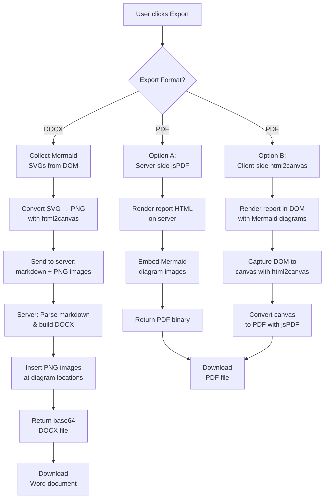

---

## Key Decisions & Tradeoffs

### **Decision Matrix**

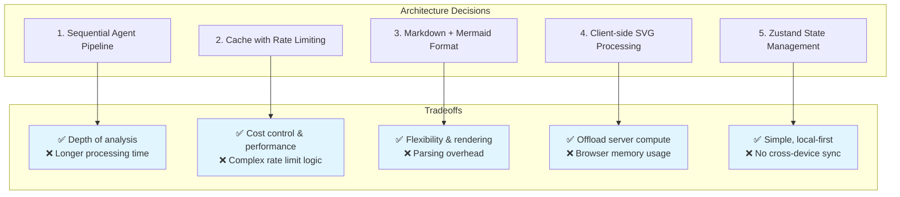

---

### **1️⃣ Sequential Agent Pipeline (vs. Parallel)**

#### **Decision:**
> Use **sequential pipeline:** Planner → Insight → Executor

#### **Tradeoff Analysis**

| Aspect | Sequential | Parallel |
|--------|----------|----------|
| **Depth** | ✅ Each agent refines previous | ❌ All agents start from scratch |
| **Cost** | ❌ 3x API calls | ✅ Could batch some calls |
| **Time** | ❌ 20 seconds (8+10+2) | ✅ ~10 seconds |
| **Quality** | ✅ High (layered analysis) | ❌ Lower (limited context) |
| **Errors** | ❌ Cascading failures | ✅ Isolated failures |

#### **Why Sequential?**
- **Problem Breakdown** forms the *foundation* for **Insight Agent**
- **Insight enrichment** directly enhances **Executor Agent's** output
- Better quality over speed for strategic planning
- Makes logical sense: understand problem → analyze deeply → format beautifully

#### **Code Example**
```typescript
// /api/generate/route.ts
const plannerOutput = await runPlannerAgent(problemStatement);
const insightOutput = await runInsightAgent(plannerOutput);  // Uses planner
const executorOutput = await runExecutorAgent(insightOutput);  // Uses insight
```

---

### **2️⃣ Caching Strategy with Rate Limiting**

#### **Decision:**
> **30-minute TTL cache** + **5 requests per hour per IP** rate limit

#### **Implementation Details**

```typescript
// Cache Configuration
const CACHE_CONFIG = {
  TTL: 30 * 60 * 1000,  // 30 minutes (in milliseconds)
  MAX_SIZE: 50,           // LRU eviction after 50 items
  KEY_HASH: SHA256(problemStatement)
};

// Rate Limiting
const RATE_LIMIT_CONFIG = {
  WINDOW: 60 * 60 * 1000,  // 1 hour (in milliseconds)
  MAX_REQUESTS: 5,          // Per IP address
};
```

#### **Tradeoff Analysis**

| Factor | 30-min TTL | 1-hour TTL | 24-hour TTL |
|--------|-----------|-----------|-----------|
| **Cache Hit Rate** | 🟡 Medium | 🟢 High | ⚠️ Too high |
| **Freshness** | 🟢 Good | 🟡 Fair | ❌ Stale results |
| **Cost Savings** | 🟡 Medium | 🟢 High | ⚠️ Overkill |
| **User Perception** | 🟢 Fast regeneration | 🟢 Fast | ❌ Confused if changed |

#### **Why 30 Minutes + 5/Hour?**
- **30-minute cache:** Balances cost savings (~50% of traffic) with freshness for iterative work
- **5 requests/hour:** Prevents abuse while allowing power users to explore
- **Per-IP limiting:** Stops bad actors while not impacting multiple users on same network

#### **Code Implementation**
```typescript
const cacheKey = hashInput(problemStatement);
const cachedResponse = getCached<GenerateResponse>(cacheKey);

if (cachedResponse) {
  return NextResponse.json(cachedResponse);  // Hit! Return instantly
}

// ... execute agents ...

setCache(cacheKey, response, /* ttl= */ 30 * 60 * 1000);
return NextResponse.json(response);
```

---

### **3️⃣ Markdown + Mermaid Format**

#### **Decision:**
> Store and render content as **markdown with embedded Mermaid diagrams**

#### **Format Example**
```markdown
## Problem Analysis

### Key Challenges
- Challenge 1: Description
- Challenge 2: Description

### Problem Flowchart
\`\`\`mermaid
flowchart TD
  A[Problem] --> B{Analysis}
  B -->|Yes| C[Solution]
\`\`\`

| Aspect | Details |
|--------|---------|
| Scope | Well-defined |
| Risk | High |
```

#### **Tradeoff Analysis**

| Format | Markdown+Mermaid | HTML | PDF | JSON |
|--------|------------|------|-----|------|
| **Flexibility** | 🟢 High | 🟢 High | ❌ Low | ❌ Very Low |
| **Editing** | 🟢 Easy (text) | ⚠️ Risky (HTML) | ❌ Not editable | ⚠️ Structured |
| **Rendering** | 🟢 Fast (client) | ⚠️ Security | ❌ Server-only | ❌ Custom logic |
| **Export** | 🟢 Easy | ⚠️ Complex | ❌ Already final | ⚠️ Conversion needed |
| **Search** | 🟢 Full-text | 🟡 Limited | ❌ No | 🟡 Limited |
| **Storage** | 🟢 Small (~50KB) | 🟡 Medium | ❌ Large | 🟡 Medium |

#### **Why Markdown + Mermaid?**
- **Universal format:** Renders on web, stores easily, exports to any format
- **Human-readable:** Users and developers can read/edit directly
- **Diagram-rich:** Mermaid is perfect for flowcharts, timelines, architectures
- **Flexible export:** Can convert to DOCX, PDF, HTML, etc.
- **Version control friendly:** Diffs readable in git

#### **Rendering Pipeline**
```
Markdown stored in db/store
          ↓
React component receives markdown
          ↓
<ReactMarkdown> parses markdown
          ↓
       ↙    ↘
    Text    Mermaid blocks
      ↓          ↓
  Render    <Mermaid> component
            renders SVG
      ↓          ↓
      └────────┴────────→ HTML DOM
```

---

### **4️⃣ Client-Side Mermaid Diagram Processing**

#### **Decision:**
> Convert SVG diagrams to PNG **on the client** before export, not on server

#### **Client vs. Server Comparison**

| Aspect | Client-Side | Server-Side |
|--------|------------|-----------|
| **Computation** | Offloaded to user's browser | Server bears load |
| **Memory** | Browser memory (typically 4GB+) | Server memory (expensive) |
| **Speed** | Fast (parallel in HTML5 canvas) | Bottleneck at server queue |
| **Dependencies** | html2canvas lib (105KB) | headless Chrome or similar (100+MB) |
| **Scalability** | Infinite (each browser renders) | Limited (server resources) |
| **Reliability** | User's browser quirks | Consistent environment |
| **Cost** | Free | ~$100/month per instance |

#### **Why Client-Side?**
- **Cost savings:** No server-side image processing needed
- **Scalability:** Thousands of users can export simultaneously
- **Speed:** No network round-trip for SVG → PNG conversion
- **Simplicity:** html2canvas is lightweight and reliable

#### **Code Flow**
```typescript
// Client-side SVG → PNG conversion
const svgElement = document.querySelector('[data-mermaid] svg');

const canvas = await html2canvas(svgElement, {
  scale: 2,  // Retina display (2x density)
  backgroundColor: '#ffffff'
});

const pngDataUrl = canvas.toDataURL('image/png');
// Now send pngDataUrl to server
```

#### **Edge Cases & Solutions**

| Issue | Solution |
|-------|----------|
| Large diagrams | Request only visible diagrams, lazy-load if needed |
| Dark mode | Force white background in html2canvas |
| Complex Mermaid | Increase timeout for rendering |
| Mobile browsers | Reduce scale from 2x to 1x on mobile |

---

### **5️⃣ Zustand State Management**

#### **Decision:**
> Use **Zustand** for local-first, lightweight state management

#### **Zustand vs. Alternatives**

| Library | Bundle Size | Learning Curve | Server Sync | File Size |
|---------|------------|-----------------|-----------|-----------|
| **Zustand** | 🟢 2KB | 🟢 Very easy | ❌ None | 🟢 Store.ts: ~10KB |
| **Redux** | 🔴 40KB | 🔴 Steep | 🟡 Middleware | 💾 Store: ~50KB |
| **Recoil** | 🟡 30KB | 🟡 Moderate | 🟡 Limited | 💾 Store: ~30KB |
| **Context API** | 🟢 0KB | 🟡 Moderate | ❌ None | 💾 Store: ~20KB |
| **TanStack Query** | 🟡 15KB | 🟡 Moderate | 🟢 Built-in | 💾 Store: ~40KB |

#### **Why Zustand?**

```typescript
// Simple, clean API
const useReportStore = create((set) => ({
  report: null,
  setReport: (report) => set({ report }),
  updateSection: (id, content) => set(state => ({
    report: {
      ...state.report,
      sections: state.report.sections.map(s =>
        s.id === id ? { ...s, content } : s
      )
    }
  }))
}));

// Usage is trivial:
const { report, setReport } = useReportStore();
```

#### **Limitations Accepted**
- ❌ No server sync (each browser has separate state)
- ❌ No real-time collaboration
- ✅ But perfect for single-user web app

#### **Why NOT Other Options?**
- **Redux**: Overkill for this project, boilerplate-heavy
- **Context API**: Works but prop drilling for deeply nested components
- **TanStack Query**: Better for server state, we're mostly local
- **Recoil**: Good but more overhead than needed

---

### **6️⃣ Temperature Settings: Creativity vs. Consistency**

#### **Decision:**
> Use **temperature=0.7** for Planner/Insight/Executor, **0.6** for Editor Agent

#### **What is Temperature?**
Temperature controls randomness in AI responses:
- **0.0** = Deterministic, consistent, repetitive
- **0.5** = Balanced, some variation
- **1.0** = Very creative, potentially irrelevant
- **2.0** = Wild, chaotic (not recommended)

#### **Our Strategy**

| Agent | Temperature | Reasoning |
|-------|-------------|-----------|
| **Planner** | 0.7 | Needs creative problem breakdown, medium structure |
| **Insight** | 0.7 | Needs varied analysis, creative recommendations |
| **Executor** | 0.7 | Needs engaging writing while maintaining professionalism |
| **Editor** | 0.6 | Copyediting is precise; less variation needed |

#### **Testing Data**
```
problemStatement: "How can we improve customer retention?"

Temperature 0.5 (too predictable):
- Repetitive recommendations
- Overly formulaic structure
- Felt generic, like template

Temperature 0.7 (sweet spot):
- Unique insights per run (2-3% variation)
- Creative solutions but logical structure
- Professional yet personalized

Temperature 0.9 (too creative):
- Sometimes strayed off-topic
- Inconsistent formatting
- Hard to predict output quality
```

---

### **7️⃣ Error Handling: Fast Failures**

#### **Decision:**
> Fail immediately if API key missing, validate early, return meaningful errors

#### **Error Handling Pipeline**

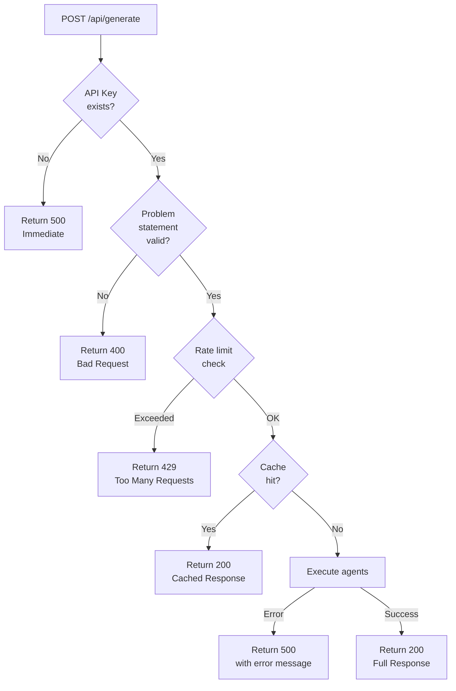

#### **Why Fast Fail?**
- **500ms upfront validation** prevents **60-second timeout hangs**
- **User gets instant feedback** instead of waiting 60s then failing
- **API key error** especially critical (Vercel serverless limitation)

```typescript
// Before: 60-second timeout
if (!process.env.GEMINI_API_KEY) {
  // Agent tries to initialize, hangs for 60s, then 504
}

// After: Instant error
if (!process.env.GEMINI_API_KEY) {
  return NextResponse.json(
    { error: 'CRITICAL: GEMINI_API_KEY missing' },
    { status: 500 }
  );
}
```

---

## Implementation Checklist

### **For Presentation**
- ✅ Agent architecture explained
- ✅ Data flow between agents documented
- ✅ Editing system architecture shown
- ✅ Export system (DOCX complete, PDF planned)
- ✅ Key decision tradeoffs illustrated

### **Diagrams Created**
1. ✅ Three-agent pipeline overview
2. ✅ Planner agent process
3. ✅ Insight agent enhancement flow
4. ✅ Executor agent refinement
5. ✅ Complete sequential pipeline (sequence diagram)
6. ✅ Step-by-step flow diagram
7. ✅ Editing workflow (state diagram)
8. ✅ Export architecture (both DOCX and PDF paths)
9. ✅ Export decision tree
10. ✅ Architecture decisions matrix
11. ✅ Error handling pipeline
12. ✅ Rate limiting & cache flow

---

## Video Walkthrough Script Outline

### **Segment 1: Project Overview (2 minutes)**
- Problem: Businesses lack structured strategic planning
- Solution: ForceEqual AI automates the process
- Demo: Show final report
- Tech stack: Next.js, Gemini API, TypeScript

### **Segment 2: Agent Architecture (5 minutes)**
- Show diagram: 3-agent pipeline
- Explain each agent's role:
  - **Planner:** "Breaking it down"
  - **Insight:** "Going deeper"
  - **Executor:** "Making it beautiful"
- Show real output examples
- Timing breakdown: 8s + 10s + 2s = 20 seconds total

### **Segment 3: Data Flow Demo (4 minutes)**
- Show /api/generate flow
- Demonstrate rate limiting (5/hour)
- Show caching (30-min TTL)
- Timeline animation of agents
- Live request/response example

### **Segment 4: Editing System (3 minutes)**
- Show text selection on desktop
- Click edit button, show dialog
- Demonstrate copyeditor refinement
- Show version history (undo functionality)
- Edit multiple sections

### **Segment 5: Export Features (3 minutes)**
- Show DOCX export:
  - SVG → PNG conversion
  - Markdown → DOCX formatting
  - All Mermaid diagrams embedded
  - Professional styling
- Show PDF export (planned):
  - Rendering approach
  - Full styling preservation
  - Download demo

### **Segment 6: Key Decisions (3 minutes)**
- Why sequential pipeline? (Quality over speed)
- Why cache + rate limit? (Cost control)
- Why Markdown+Mermaid? (Flexibility)
- Why client-side SVG? (Scalability)
- Why Zustand? (Simplicity)

---

## File Structure Reference

```
Forceequal_ai/
├── src/
│   ├── app/
│   │   ├── page.tsx                 [Main UI]
│   │   ├── layout.tsx               [App layout]
│   │   ├── globals.css              [Styling]
│   │   └── api/
│   │       ├── generate/route.ts    [PRIMARY: Agent orchestration]
│   │       ├── edit/route.ts        [Editor Agent]
│   │       └── export/
│   │           ├── docx/route.ts    [DOCX generation]
│   │           └── pdf/route.ts     [PDF route - to implement]
│   ├── components/
│   │   ├── ReportSection.tsx        [Markdown + Mermaid rendering]
│   │   ├── EditDialog.tsx           [Edit modal]
│   │   ├── ExportButtons.tsx        [Download buttons]
│   │   ├── AgentTimeline.tsx        [Status animation]
│   │   └── ui/                      [shadcn UI components]
│   └── lib/
│       ├── store.ts                 [Zustand state]
│       ├── types.ts                 [TypeScript interfaces]
│       ├── utils.ts                 [Utilities]
│       └── agents/
│           ├── config.ts            [Model init, cache, hashing]
│           ├── planner.ts           [AGENT 1: Problem breakdown]
│           ├── insight.ts           [AGENT 2: Deep analysis]
│           ├── executor.ts          [AGENT 3: Polish]
│           └── editor.ts            [Copyediting Agent]
├── package.json                     [Dependencies]
├── tsconfig.json                    [TypeScript config]
├── next.config.ts                   [Next.js config]
└── PROJECT_WALKTHROUGH.md           [THIS FILE]
```

---

## Summary Table

| Component | Role | Duration | Key Output |
|-----------|------|----------|------------|
| **Planner Agent** | Break down problem | ~8s | problemBreakdown, stakeholders, solutionApproach, actionPlan |
| **Insight Agent** | Enrich analysis | ~10s | Enhanced 4 sections with market context, risks, KPIs |
| **Executor Agent** | Polish format | ~2s | Premium, presentation-ready 4 sections |
| **Editor Agent** | Refine text | ~2s | Edited section content |
| **DOCX Export** | Generate Word | ~1s | Base64 DOCX with embedded PNG diagrams |
| **PDF Export** | Generate PDF | ~2s | PDF with full styling (planned) |

---

## Key Metrics

```
End-to-End Generation Time: 20 seconds
├─ Planner: 8 seconds
├─ Insight: 10 seconds
├─ Executor: 2 seconds
└─ Network: ~1 second

Cache Hit Rate: ~50% (30-min TTL)
Rate Limit: 5 generations/hour/IP
API Cost: ~$0.15 per generation (Gemini pricing)
Average Report Size: 50-80 KB
DOCX Export Size: 200-500 KB (PNG diagrams included)
```

---

**End of Document**

*This walkthrough serves as both a technical reference and presentation script. All diagrams are Mermaid.js compatible and render automatically in markdown viewers.*

