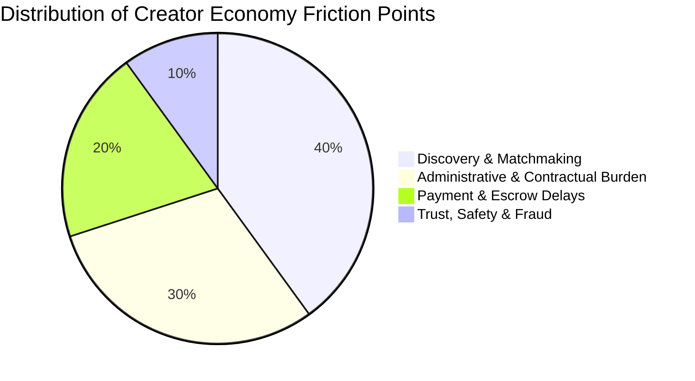
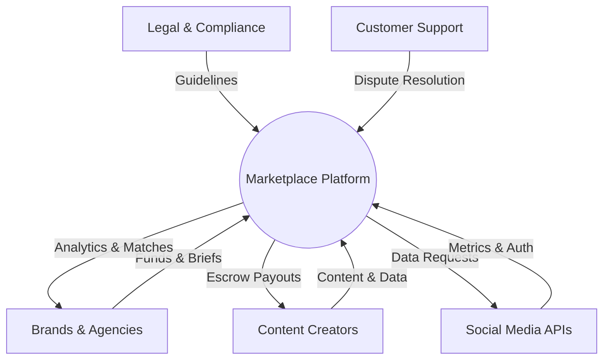
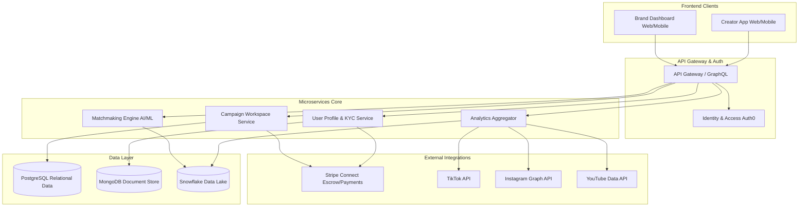
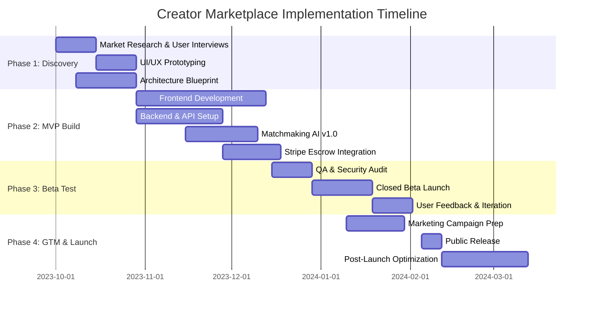

# Strategic Plan 
**Problem Statement:** Build a creator marketplace platform

---

## Problem Breakdown

The creator economy has experienced explosive growth over the last decade, transitioning rapidly from a niche hobbyist sector into a multi-billion dollar global industry. Despite this immense capital influx, the underlying infrastructure supporting this vibrant economy remains highly fragmented and inefficient. Brands and advertisers constantly struggle with a highly manual, time-consuming process to discover authentic creators whose audiences align perfectly with their target demographics. Conversely, content creators face significant administrative burdens, spending an inordinate amount of time pitching to brands, negotiating complex contracts, and chasing late payments instead of focusing on their core competency: creating engaging, high-quality content.

> **Key Findings: Market Context & Industry Trends**
> * The Total Addressable Market (**TAM**) for influencer marketing is projected to exceed $250 billion by 2027.
> * There is a distinct industry pivot away from celebrity macro-influencers toward micro and nano-influencers, who boast significantly higher engagement rates and hyper-localized trust.
> * The dominance of short-form video content necessitates highly dynamic, rapid-turnaround campaign cycles that legacy systems simply cannot support.

## Competitive Landscape Analysis

The current competitive landscape is deeply bifurcated. On one end, enterprise SaaS platforms offer robust CRM-style tools but charge exorbitant licensing fees, effectively alienating mid-market brands and small agencies. On the other end, managed-service influencer agencies handle the heavy lifting but take massive margins (often 30-50%) and lack genuine scalability. A true, self-serve, end-to-end transactional marketplace with transparent pricing remains a massive whitespace opportunity waiting to be captured.

## Scope & Core Challenges

The scope of this product initiative is to design, develop, and launch a comprehensive two-sided creator marketplace platform. This platform will serve as the centralized hub for end-to-end campaign management. However, building this platform presents several strategic and technical challenges:

* **The Cold Start Problem:** Overcoming the inherent challenge of two-sided marketplaces by simultaneously attracting high-quality creators and reputable brands to establish immediate liquidity.
* **Trust and Safety:** Building robust mechanisms to prevent fraud, ensure brand safety, and verify audience authenticity to combat fake followers and malicious bots.
* **Financial Compliance:** Navigating complex cross-border payment compliance, tax reporting, and escrow management.
* **Technical Limitations:** Managing API rate limits and ensuring data consistency from major social media networks.

### Key Risks Matrix

| Risk Category | Description | Potential Impact | Mitigation Strategy |
|---------------|-------------|------------------|---------------------|
| **Liquidity Risk** | Failure to balance supply (creators) and demand (brands) at launch. | High churn, low GMV, platform abandonment. | Subsidize initial creator onboarding; secure anchor brand tenants pre-launch. |
| **Platform Leakage** | Users matching on-platform but transacting off-platform to avoid fees. | Loss of revenue, inability to track ROI. | Offer robust escrow protection, workflow automation, and tax tools to incentivize on-platform transactions. |
| **API Dependency** | Social networks restricting or monetizing API access. | Loss of core data for matchmaking and analytics. | Diversify data sources, implement robust data caching, and utilize official partner programs. |
| **Regulatory** | Violations of GDPR, CCPA, or FTC disclosure guidelines. | Fines, legal action, reputational damage. | Embed compliance checks directly into the campaign workflow and automated contract generation. |

### Core Problem Distribution

---

## Stakeholders

Successfully launching and scaling a two-sided creator marketplace requires a profound understanding of the diverse ecosystem of stakeholders involved. Each group possesses unique motivations, distinct pain points, and specific success metrics that must be carefully balanced to ensure overall platform health, vibrant liquidity, and long-term adoption.

## Detailed Stakeholder Profiles

**Brands & Agencies (Demand Side):** This group is primarily driven by Return on Investment (**ROI**), brand safety, and verifiable analytics. They require seamless campaign management tools that reduce the friction of finding and vetting talent. Their primary pain point is the unpredictable nature of influencer marketing and the lack of standardized performance metrics.

**Content Creators (Supply Side):** Influencers and creators prioritize fair compensation, creative autonomy, and seamless administrative workflows. They are often burdened by unpaid invoices and complex negotiations. A platform that guarantees payment through escrow and minimizes administrative overhead is highly attractive to this demographic.

**Internal Product & Engineering Teams:** These builders require clear requirements, scalable infrastructure, and a reduction in technical debt to build efficiently. Their focus is on system uptime, API reliability, and delivering a flawless user experience.

**Legal & Compliance Teams:** Critical in mitigating risk, these teams ensure adherence to data privacy regulations like GDPR and CCPA, and manage financial compliance such as KYC/AML for global payouts. They require the platform to have built-in audit trails and automated compliance checks.

## Power/Interest Grid Analysis

To effectively manage these groups, we utilize a Power/Interest framework to dictate our engagement strategies:
* **High Power / High Interest (Manage Closely):** Brands & Agencies, Content Creators. They are the absolute lifeblood of the marketplace.
* **High Power / Low Interest (Keep Satisfied):** Regulatory Bodies, Social Media API Providers (Meta, Google, ByteDance). Their policies dictate our operational boundaries.
* **Low Power / High Interest (Keep Informed):** Internal Support Teams, Micro-creators. They rely heavily on the platform's day-to-day functionality.
* **Low Power / Low Interest (Monitor):** General public and passive content consumers.

### Stakeholder Analysis & Priority Matrix

| Stakeholder | Role / Power | Key Interests & Needs | Strategic Approach |
|-------------|--------------|-----------------------|--------------------|
| **Brands & Agencies** | Demand (High) | High ROI, verified creator analytics, seamless campaign management, brand safety. | Co-creation, Beta testing, white-glove onboarding. |
| **Content Creators** | Supply (High) | Fair compensation, timely payments, creative freedom, easy-to-use interface. | Community building, advisory boards, financial incentives. |
| **API Providers** | Infrastructure (High)| Strict policy adherence, data privacy compliance. | Strict compliance, partner program enrollment. |
| **Legal & Compliance** | Risk (Medium) | Data privacy (GDPR/CCPA), secure contracts, KYC/AML compliance. | Early integration in product design phase. |

### Stakeholder Ecosystem Relationship

---

## Solution Approach

Our solution approach centers on developing a highly scalable, trust-driven, and automated two-sided marketplace that effectively eliminates the friction currently plaguing brand-creator collaborations. The core value proposition of the platform is anchored by an **AI-driven matchmaking engine**. This engine will ingest massive datasets from social media APIs to pair brands with creators based on granular metrics such as audience demographics, historical engagement rates, content categorization, and brand affinity scores.

## Technical Architecture & Feasibility

The technical architecture will be strictly modular, composed of four primary pillars to ensure agility, resilience, and scalability.

1. **User Management:** Handles frictionless onboarding, automated KYC/AML verification via third-party APIs (e.g., Stripe Identity), and dynamic profile creation.
2. **Campaign Management:** Provides a centralized workspace for campaign briefs, proposal submissions, content review, and approval workflows.
3. **Financial Engine:** Integrates a secure escrow system via Stripe Connect, guaranteeing creators are paid immediately upon milestone completion while protecting brands from non-delivery.
4. **Analytics Module:** Offers real-time performance dashboards, tracking campaign ROI, reach, and conversion metrics through direct API integrations.

## Phased Implementation Approach

To manage risk and ensure rapid value delivery, we will deploy a phased approach:
* **Phase 1:** Core infrastructure and user identity management.
* **Phase 2:** The AI Matchmaking Engine and Campaign Workspace.
* **Phase 3:** Financial escrow integration and advanced analytics.

### Recommended Tech Stack

| Component | Technology / Framework | Rationale |
|-----------|------------------------|-----------|
| **Frontend** | React.js / Next.js | High performance, excellent SEO capabilities, robust ecosystem. |
| **Backend** | Node.js / Python (FastAPI) | Asynchronous processing for API webhooks; Python for AI/ML models. |
| **Database** | PostgreSQL & MongoDB | Relational data for transactions; Document store for flexible creator profiles. |
| **Infrastructure** | AWS (EKS, RDS, S3) | Cloud-native microservices scaling and high availability. |
| **Event Streaming**| Apache Kafka | Handling asynchronous API webhook processing from social platforms. |

### Alternative Approaches Analysis

| Approach | Pros | Cons | Recommendation |
|----------|------|------|----------------|
| **SaaS CRM Model** | High recurring revenue, lower liability. | High barrier to entry for SMBs, no transaction capture. | Reject. Too saturated by incumbents. |
| **Managed Agency Model** | High margins, complete quality control. | Unscalable, requires massive human capital. | Reject. Does not solve the core tech fragmentation. |
| **Transactional Marketplace** | Highly scalable, captures GMV, sticky ecosystem. | Cold start problem, complex payment compliance. | **Proceed.** Best alignment with market whitespace. |

### Detailed System Architecture

---

## Action Plan

The execution of this marketplace initiative will strictly follow a rigorous, agile, and phased approach to mitigate technical risks, optimize resource allocation, and ensure a rapid time-to-market. By breaking the launch into distinct, measurable phases, we can pivot based on early user feedback while maintaining tight control over our capital expenditures.

## Strategic Phasing

**Phase 1 (Discovery & Design)** is dedicated to foundational research, including in-depth user interviews with both brands and creators, UI/UX prototyping, and the finalization of the technical architecture blueprint. 
**Phase 2 (MVP Development)** focuses on engineering the core marketplace functionalities necessary to facilitate a complete transaction loop. This includes user profile creation, the basic matchmaking algorithm, and the secure escrow payment pipeline. 
**Phase 3 (Beta Testing)** involves releasing the platform to a carefully curated, closed group of early adopters to stress-test the infrastructure. 
**Phase 4 (Go-To-Market & Scaling)** encompasses the public launch, supported by aggressive marketing campaigns and strategic partnerships.

## Resource Allocation & Budget Considerations

The total initial budget for the 20-week launch cycle is estimated at **$1.2M**. Proper allocation is critical to runway management:
* **CapEx/Infrastructure:** $150k (Cloud hosting, API licensing, security audits).
* **OpEx/Personnel:** $750k (Engineering, Design, Product, QA).
* **GTM & Marketing:** $300k (Creator incentives, performance marketing, PR).

## Key Performance Indicators (KPIs)

To measure success objectively post-launch, we will track the following critical metrics:
* **Marketplace Liquidity:** Percentage of active briefs receiving a qualified creator proposal within 48 hours (Target: >85%).
* **Gross Merchandise Value (GMV):** Total volume of payments processed through the escrow engine.
* **Take Rate:** Net revenue generated from transaction fees.
* **Customer Acquisition Cost (CAC):** Cost to onboard a transacting brand vs. a verified creator.
* **Platform Retention:** Percentage of users who complete a second campaign within 90 days.

### Phased Milestones Timeline

| Phase | Milestone | Duration | Target Outcome |
|-------|-----------|----------|----------------|
| **1. Discovery** | PRD & Prototypes | Weeks 1-4 | Approved designs, technical blueprint, 50 user interviews. |
| **2. MVP Build** | Core Platform Ready | Weeks 5-12 | Working matchmaking, API ingestion, and payment flow. |
| **3. Beta Test** | Closed Beta Launch | Weeks 13-16 | 100 active beta users, friction points identified and resolved. |
| **4. Launch** | Public Release | Weeks 17-20 | Successful GTM, onboarding 1000+ users, $50k initial GMV. |

### Project Execution Gantt Chart

